# De Cero a Domain Admin: Reventando un Active Directory con AS-REP Roasting

**Plataforma:** TryHackMe · **Sala:** [Attacktive Directory](https://tryhackme.com/room/attacktivedirectory) · **Dificultad:** Media

Esta semana resolví la room **Attacktive Directory** de TryHackMe, y quiero dejar constancia del proceso completo — no solo los comandos que funcionaron, sino también dónde me atasqué y cómo lo resolví, porque esa parte suele quedarse fuera de la mayoría de writeups y es la que más se aprende releyendo después.

El objetivo: partiendo de cero acceso a un dominio Active Directory, llegar a comprometer la cuenta de Administrator del dominio. El camino pasa por Kerberos, SMB, un grupo de Windows que nadie mira dos veces, y termina volcando toda la base de datos de identidades del dominio de una sola pasada.

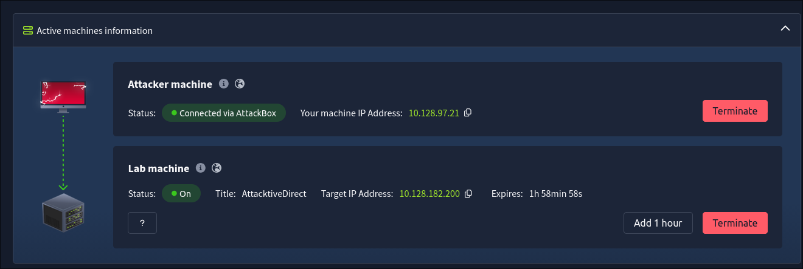

## Reconocimiento

Antes de tocar nada, confirmé que la máquina objetivo era un Controlador de Dominio mirando su huella de puertos:

```bash
nmap -sV -sC 10.128.182.200
```

Kerberos en el 88, LDAP en el 389, SMB en el 445, todos a la vez — esa combinación es prácticamente una firma inequívoca de que estás delante de un DC.

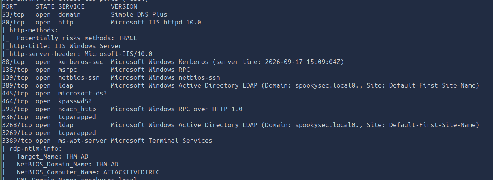

Con el objetivo confirmado, tocaba enumerar usuarios del dominio. Aquí tuve el primer tropiezo real: probé primero con una wordlist genérica de nombres propios (`names.txt` de SecLists) y luego con una lista de usuarios corporativos típicos (`top-usernames-shortlist.txt`). Las dos dieron **0 usuarios válidos**. Tenía sentido en retrospectiva — esta room usa cuentas de servicio con nombres temáticos, no nombres de persona ni usuarios genéricos tipo `admin`/`test`. Construí una lista pequeña a mano con los patrones típicos de este tipo de laboratorio:

```bash
kerbrute userenum -d spookysec.local --dc 10.128.182.200 candidatos.txt
```

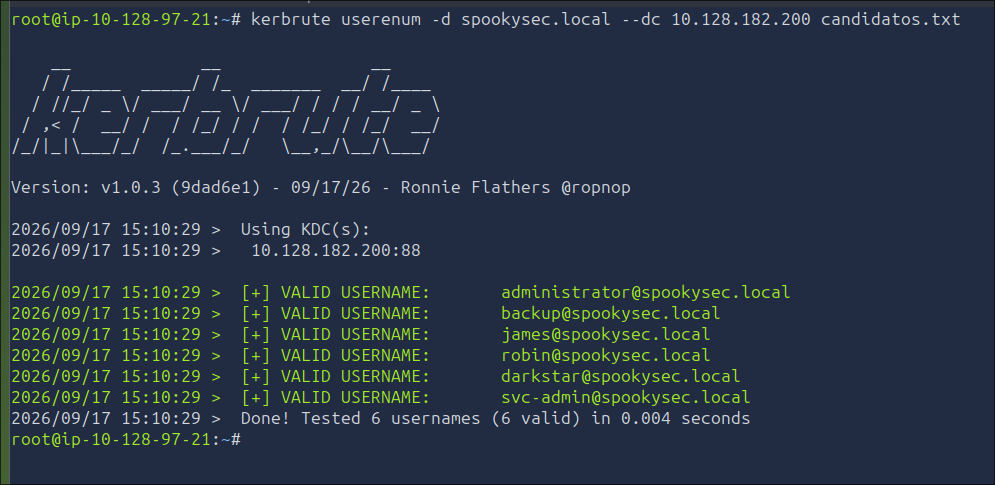

La lección de esta parte: cuando una wordlist genérica da cero resultados contra un objetivo con nombre temático, no es problema de la herramienta — hay que razonar sobre el contexto en vez de seguir probando listas cada vez más grandes a ciegas.

## AS-REP Roasting: la cuenta que no pide contraseña

Con `svc-admin` confirmado como usuario real, el siguiente paso fue comprobar si tenía la preautenticación Kerberos desactivada — una mala configuración bastante común en cuentas de servicio, que permite pedir su AS-REP (un paquete cifrado con su contraseña) **sin necesitar ninguna credencial previa**:

```bash
impacket-GetNPUsers spookysec.local/ -usersfile candidatos.txt -no-pass -dc-ip 10.128.182.200
```

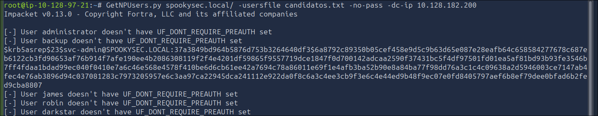

`svc-admin` respondió. El hash resultante es del tipo `Kerberos 5, etype 23, AS-REP` (modo 18200 en Hashcat), y lo lancé contra rockyou:

```bash
hashcat -m 18200 hash_asrep.txt /usr/share/wordlists/rockyou.txt
```

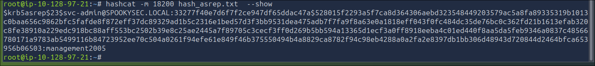

Hashcat respondió con `All hashes found as potfile and/or empty entries` en vez de ponerse a crackear. No es un error: como ya había roto este mismo hash en un intento anterior de la sala, lo tenía guardado en su potfile (`~/.hashcat/hashcat.potfile`) y lo reconoció al instante sin repetir el ataque de diccionario. Para recuperar la contraseña en claro solo hace falta pedírsela directamente:

```bash
hashcat -m 18200 hash_asrep.txt --show
```

La contraseña: `management2005`. Nada sofisticado — una palabra más un año, el patrón más predecible que existe, y aun así suficiente para comprometer una cuenta de dominio.

## SMB: la credencial de un operador de backups

Con `svc-admin` autenticado, tocaba ver qué recursos compartidos había disponibles:

```bash
smbclient -L //10.128.182.200/ -U 'spookysec.local\svc-admin%management2005'
```

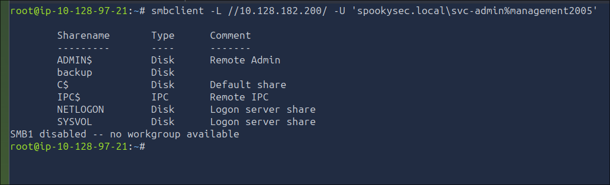

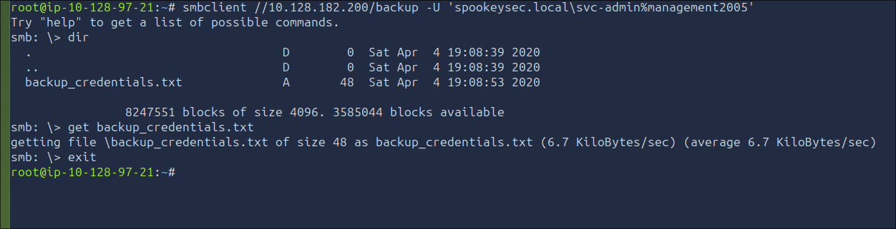

Uno de los shares no administrativos tenía un fichero con una cadena en Base64. Vale la pena aclarar esto porque es un error de concepto habitual: Base64 **no es cifrado**, es solo una codificación reversible sin clave. Cualquiera que la encuentre puede revertirla con un simple:

```bash
base64 -d <fichero>
```

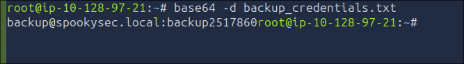

El contenido reveló credenciales de una cuenta llamada `backup`, perteneciente al grupo `Backup Operators`.

## Por qué `Backup Operators` no es un grupo cualquiera

A simple vista, `Backup Operators` suena a un grupo operativo menor. No lo es. Por diseño de Windows, sus miembros reciben el privilegio `SeBackupPrivilege`, que les permite **leer cualquier archivo del sistema saltándose los permisos NTFS normales** — porque una copia de seguridad tiene que poder leerlo todo, sin excepción.

En un Controlador de Dominio, eso incluye `ntds.dit`: la base de datos completa de Active Directory, con los hashes de todos los usuarios del dominio. Un miembro de `Backup Operators` puede llegar hasta ahí sin ser Domain Admin.

## Volcando el dominio entero con secretsdump

Con la credencial de `backup`, el paso final fue pedirle al DC que replicara sus secretos — el mismo mecanismo que usa un segundo DC legítimo para sincronizarse, conocido como DCSync:

```bash
impacket-secretsdump -just-dc backup:'<contraseña>'@10.128.182.200
```

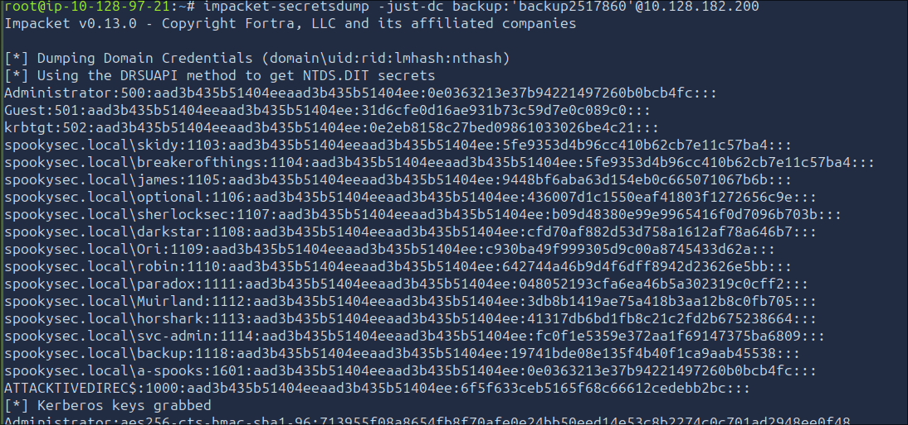

Una sola ejecución, y salió el hash NTLM de cada usuario del dominio — incluido `Administrator` y la propia cuenta `krbtgt`, cuya clave secreta es la que cifra todos los tickets Kerberos del dominio.

```text
Administrator:500:aad3b435b51404eeaad3b435b51404ee:0e0363213e37b94221497260b0bcb4fc:::
```

El primer bloque (`aad3b435...`) es un valor constante que aparece siempre que el hashing LM está desactivado — no es un hash real. El segundo bloque es el hash NTLM que de verdad importa.

## El final: Administrator sin saber su contraseña

Con ese hash, entré directamente vía Pass-the-Hash, sin necesitar la contraseña en texto plano en ningún momento:

```bash
evil-winrm -i 10.128.182.200 -u Administrator -H 0e0363213e37b94221497260b0bcb4fc
```

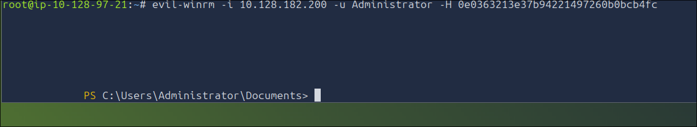

## Lo que no sale en la mayoría de writeups

`svc-admin` estaba confirmado, con contraseña válida, y aun así **no pude conectar por Evil-WinRM con esa cuenta** — el puerto 5985 estaba abierto, la contraseña era correcta, y aun así la conexión fallaba. La explicación: WinRM, a diferencia de SMB, solo lo pueden usar los miembros de grupos concretos (`Administrators` o `Remote Management Users`) en esa máquina en particular. Que una cuenta sea AS-REP roasteable no significa que tenga permiso de login remoto interactivo.

La solución no fue insistir con `svc-admin` — fue aprovechar que ya tenía una sesión como Administrator, una cuenta con privilegios de sobra para leer los archivos de cualquier otro usuario del sistema directamente:

```powershell
type C:\Users\svc-admin\Desktop\*.txt
type C:\Users\backup\Desktop\*.txt
```

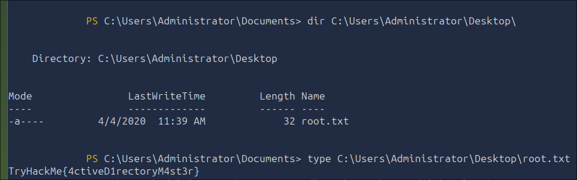
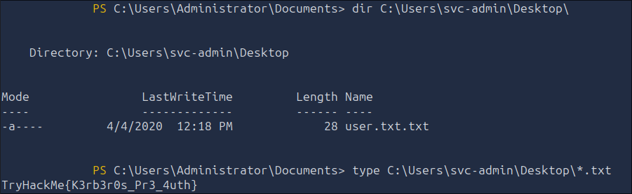
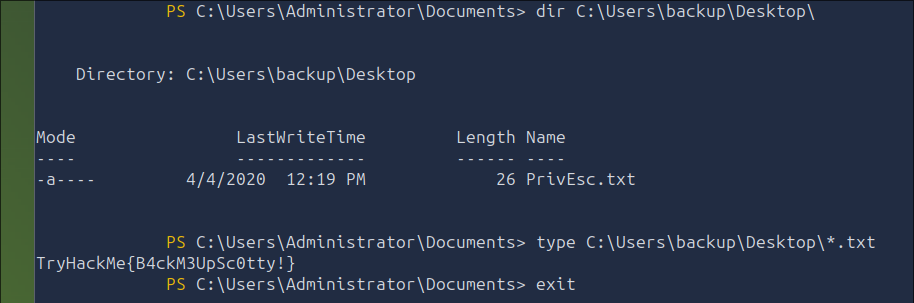

Ese es, probablemente, el aprendizaje más reutilizable de todo el ejercicio: cuando una vía directa falla por permisos, antes de perder tiempo depurando por qué, vale la pena preguntarse si ya tienes acceso a una cuenta con privilegios suficientes para llegar al mismo sitio por otro camino.
